# Niyam Notionly

**Codex skills that draw in a monochrome, hand-drawn, Notion-like style** — one ink, tapered
brush linework, transparent background — and compose those illustrations into infographics.

<table>
<tr>
<td align="center">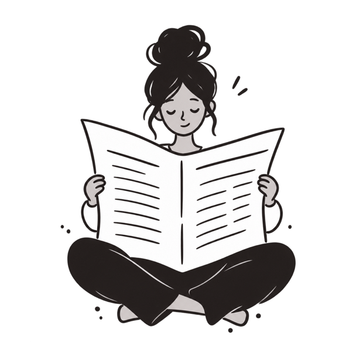</td>
<td align="center">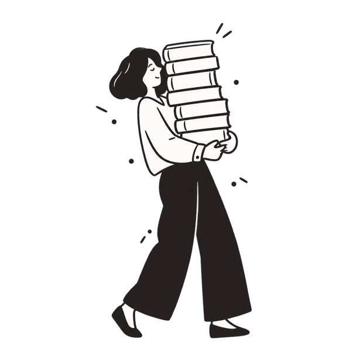</td>
<td align="center">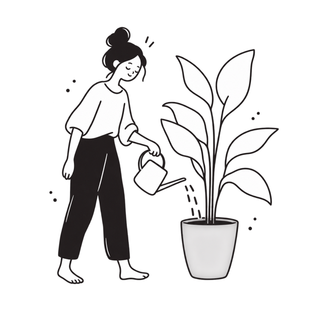</td>
</tr>
</table>

| Skill | Folder | Makes |
|---|---|---|
| `niyam-notionly-illustrations` | [`skill/`](skill/) | Illustrations, characters, icons, spot marks — SVG or transparent PNG |
| `niyam-notionly-infographic` | [`infographic/`](infographic/) | Data posters, 16:9 slides, square social cards |

---

## The style, measured

This spec was not written from memory or from blog posts, and it is **not a clone of any one
library**. It was measured across several hand-drawn illustration libraries — ink sampled
from pixels, tints confirmed as alpha variants, coverage measured with Pillow, and SVG
sources inspected to see how the linework is really built.

- **One ink: `#231F20`.** Warm near-black, never `#000000`. No colour at all.
- **Greys are that same ink at 15–25% opacity**, never a separate hex.
- **Ink covers 6–16% of the canvas.** The drawing is overwhelmingly empty.
- **Linework is filled paths, never strokes** — SVG has no variable-width stroke, so a
  tapered line has to be a closed filled shape.
- **Background transparent**, canvas square.

### What the cross-source comparison showed

| Library | Ink | Accent | Ink coverage | Linework |
|---|---|---|---|---|
| [Notioly](https://www.notioly.com/) — 13 PNGs measured | `#231F20` | none | 6–16% | tapered |
| [Open Doodles](https://www.opendoodles.com/) — 8 SVGs inspected | `#000000` | one | 16–24% | tapered |

They agree on what matters: one dominant ink, at most one accent, a mostly empty canvas, and
**linework built from filled paths** — every Open Doodles SVG carries `stroke="none"`. Where
they differ, this project picks the warmer ink, no accent at all, and the sparser density,
and [`style-dna.md`](skill/references/style-dna.md) says why.

Popular write-ups claim the style is "pure linework with no fills" and "black on white".
Both are wrong: there are heavy solid black masses, and the ink is not pure black. Where the
write-ups contradicted the pixels, the pixels won.

Full spec: [`skill/references/style-dna.md`](skill/references/style-dna.md) ·
Sources: [`skill/NOTICE.md`](skill/NOTICE.md)

---

## Install

```bash
git clone https://github.com/<you>/niyam-notionly.git
cd niyam-notionly
./install.sh
```

Installs every folder containing a `SKILL.md` into `~/.codex/skills/` under its `name:`.
Nested skills install flat and are stripped from their parent's copy, so nothing ships
twice. `examples/` sits outside both skills and is never copied. Restart Codex afterwards.

## Use in Codex

```
Use $niyam-notionly-illustrations to draw a person carrying a stack of books. SVG.
Use $niyam-notionly-illustrations — 6 icons: book, calendar, inbox, plant, coffee, checklist. SVG.
Use $niyam-notionly-infographic to build a poster from examples/japan-buffers.md
```

---

## Gallery

Everything below was generated with the prompts in this repo.

### Characters

Generated in Codex from [`subject-prompts.md`](skill/references/subject-prompts.md).

<table>
<tr><td align="center"><br><sub>Person at a desk, front view</sub></td><td align="center"><br><sub>Reading a newspaper</sub></td><td align="center">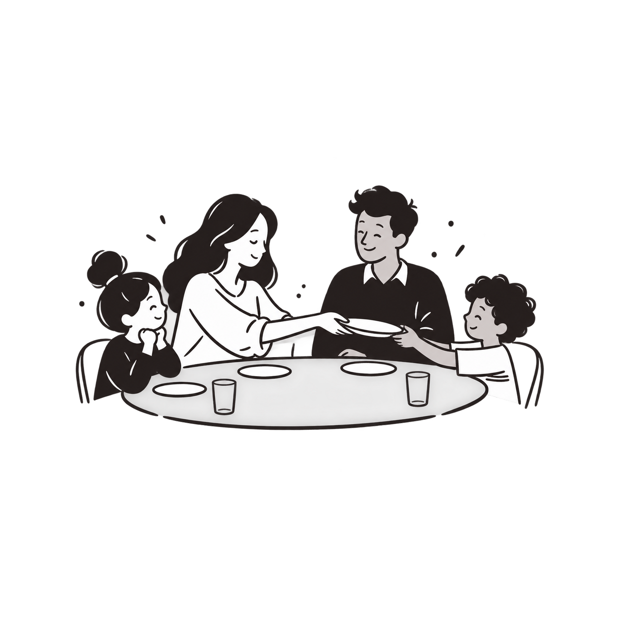<br><sub>Family of four at dinner</sub></td></tr>
<tr><td align="center"><br><sub>Carrying a stack of books</sub></td><td align="center"><br><sub>Watering a plant</sub></td><td align="center">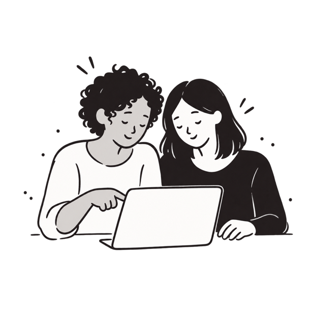<br><sub>Two people over a laptop</sub></td></tr>
<tr><td align="center">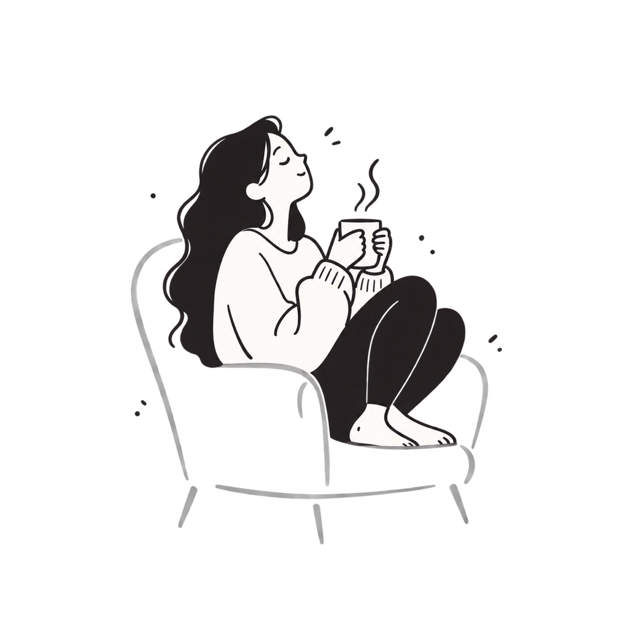<br><sub>Resting with coffee</sub></td><td align="center">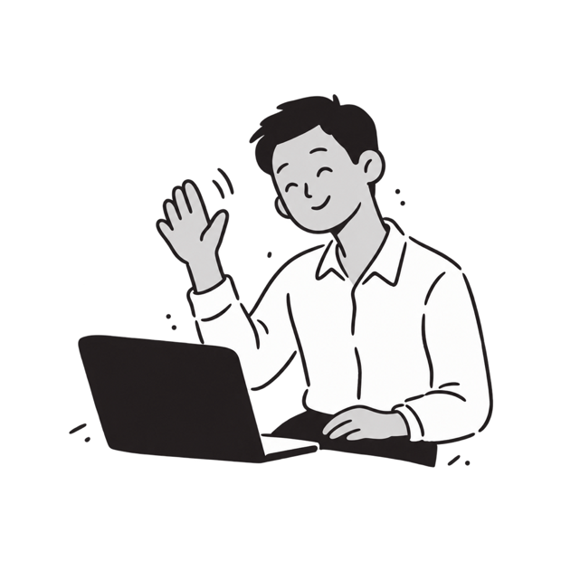<br><sub>On a video call</sub></td><td align="center">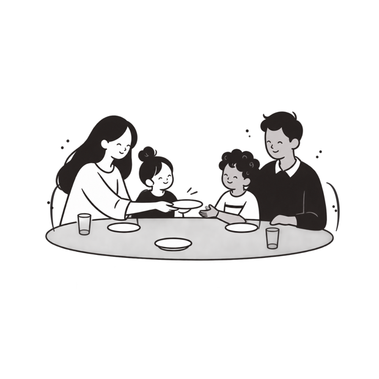<br><sub>Family dinner, first pass</sub></td></tr>
</table>

### Icons

Hand-authored SVG on a 24px grid. Monoline is correct at icon scale — this is the one place
the style does *not* taper.

<table>
<tr><td align="center">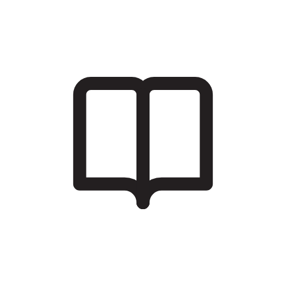<br><sub>book</sub></td><td align="center"><br><sub>calendar</sub></td><td align="center"><br><sub>inbox</sub></td><td align="center">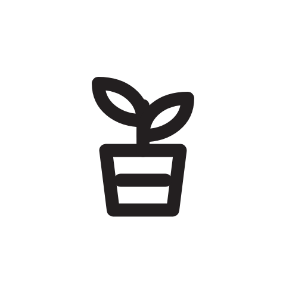<br><sub>plant</sub></td><td align="center"><br><sub>coffee</sub></td><td align="center"><br><sub>checklist</sub></td></tr>
</table>

### Spots

Objects and props, hand-authored SVG via
[`taper.py`](skill/assets/taper.py). Objects hand-author well this way; figures do not.

<table>
<tr><td align="center"><br><sub>suitcase</sub></td><td align="center">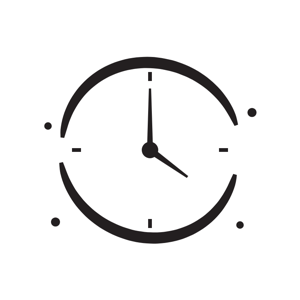<br><sub>clock</sub></td><td align="center">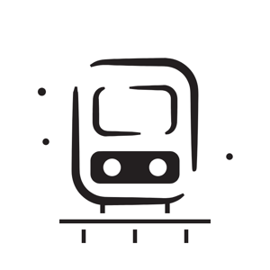<br><sub>train</sub></td><td align="center">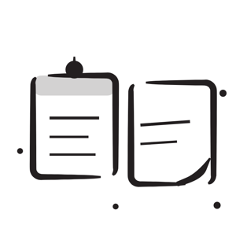<br><sub>two days</sub></td><td align="center"><br><sub>coffee</sub></td></tr>
</table>

### Same prompt, different tools

The portable prompt run through ChatGPT and Gemini, unchanged.

<table>
<tr><td align="center">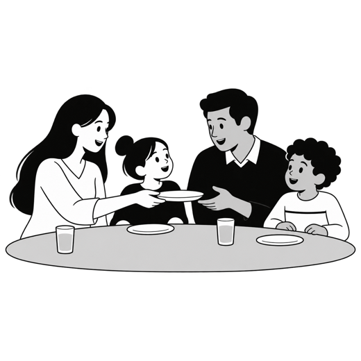<br><sub>ChatGPT</sub></td><td align="center">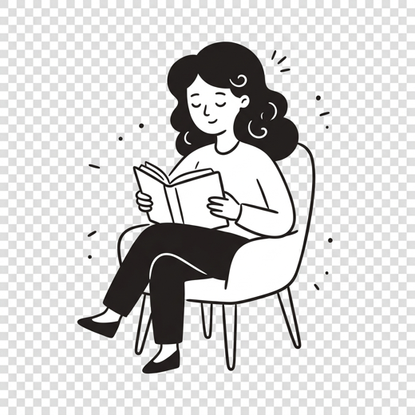<br><sub>Gemini</sub></td><td align="center">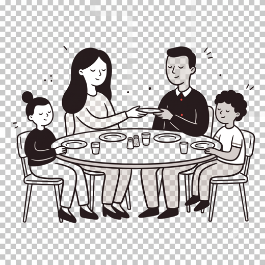<br><sub>Gemini</sub></td></tr>
</table>

---

## Prompts

Self-contained — paste into **ChatGPT, Gemini or Claude** with no skill installed.

> **Claude cannot generate raster images.** Give it the SVG prompt instead; it returns real
> editable vector.

### 1 — Raster (ChatGPT / Gemini)

```text
Draw a single hand-drawn Notion-style line illustration. Follow this spec exactly.

SUBJECT: [DESCRIBE ONE ORDINARY ACTION, ONE SENTENCE]

INK: Strictly monochrome. One warm near-black, hex #231F20, and nothing else. No colour
anywhere. Every mid-tone is that same ink at about 20% opacity, never a separate grey.
Opaque white fills where shapes overlap. Never use pure black #000000.

LINE: Hand-drawn with a tapered brush pen — strokes swell in the middle and thin to a point
at each end. Slight confident wobble. Rounded terminals. Open contours with small
deliberate gaps. No hatching, texture, shadow, gradient or glow. Not uniform monoline.

DENSITY: Very sparse. Ink covers only about 10% of the canvas. The subject is centred and
fills roughly 60% of the frame, with a generous empty margin on all four sides. Nothing
touches the edge.

VALUE: Anchor the composition with one or two solid black masses — normally the hair and
the trousers or skirt. Everything else is white with a black outline. Never fill garments
with grey.

FIGURE: Adult proportions, about 6.5 heads tall. Narrow shoulders, simple tube limbs,
mitten hands with one or two finger separations, small solid-black wedge shoes. Generous,
specific hair drawn as a confident filled silhouette with a few white curls cut into it.
Not chibi, not a mascot, no oversized head.

FACE: Almost empty. Eyes are two short downward arcs, closed and content. A tiny hook nose.
A small curved mouth. No pupils, no blush, no eyelashes, no teeth.

ACCENTS: Eight to ten tiny filled dots and short dashes scattered asymmetrically around the
figure, plus two or three small tick lines near the head.

BACKGROUND: Fully transparent. No scenery, no ground line, no frame, no border.

OUTPUT: Square 1:1, 1024x1024, transparent PNG.

DO NOT INCLUDE: any colour, pure black, gradients, shadows, textures, backgrounds, ground
lines, frames, flat vector geometry, corporate memphis, blobby limbs, cute kawaii faces,
3D, isometric, or any text or lettering in the image.
```

### 2 — SVG (Claude, or any model, for real vector)

```text
Write me a single SVG illustration in Notion/Notioly style. Output only the SVG code.

SUBJECT: [DESCRIBE ONE ORDINARY ACTION, ONE SENTENCE]

SPEC:
- viewBox="0 0 1024 1024", no width/height attributes, transparent background.
- One ink colour only: #231F20. No other colour. Never #000000.
- Mid-tones are the same ink with fill-opacity="0.2". Never a separate grey hex.
- Opaque #FFFFFF fills where shapes must overlap.
- Tapered strokes: do NOT use the stroke attribute for the linework. Draw each stroke as a
  CLOSED FILLED PATH — an outward curve and a return curve meeting at a point at each end,
  thickest through the middle third. Like this:
  <path d="M12 96 C 26 44, 58 18, 96 14 C 60 26, 32 52, 20 98 Z" fill="#231F20"/>
- Solid black masses for hair and for trousers or skirt. Everything else white with an
  outlined contour.
- Subject centred, occupying about 60% of the viewBox, generous margin on all sides,
  nothing touching the edge.
- 8-10 small filled dots and dashes scattered asymmetrically as accents.
- Figure about 6.5 heads tall, narrow shoulders, tube limbs, mitten hands, black wedge
  shoes. Face: two short downward arcs for closed eyes, tiny hook nose, small curved mouth.
- No background rect, no frame, no ground line, no text, no filters, no gradients.

Build the figure from 15-40 tapered filled paths plus the solid masses. Keep the path data
readable with whole-number coordinates where you can.
```

### 3 — Icons (any model, SVG)

```text
Write SVG icons in Notion style. Output only code, one SVG per icon.

ICONS: [LIST THEM, e.g. book, calendar, inbox, plant]

SPEC: viewBox="0 0 24 24". stroke="#231F20", stroke-width="1.75", fill="none",
stroke-linecap="round", stroke-linejoin="round". 2px clear padding so the live area is
20x20. Uniform monoline — no tapering on icons. 3-6 paths maximum per icon. One concept
each. No fills, no dots, no text, no background.
```

### Using a reference image

Attaching 2–3 references beats any amount of prose, especially in Gemini. Paste this above
the spec:

```text
Match the drawing style of the attached images exactly: the tapered brush linework, the
single near-black ink with no colour, the solid black hair and trousers against white
garments, the sparse open composition and the scattered accent dots.

Match the STYLE only. Do not copy the pose, the composition, the props or the characters —
invent a new scene for the subject below.
```

That last paragraph matters. Without it the model reproduces the reference composition,
which is both a worse result and someone else's drawing.

### When it comes back wrong

| Wrong | Paste |
|---|---|
| It added colour | `Redo in strictly one ink, #231F20, and white. No colour of any kind anywhere.` |
| Too dense | `Far sparser. Reduce ink to about 10% of the canvas, strip interior detail, keep garments white with only an outline, enlarge the margins.` |
| Looks like clip art | `Redraw the linework with a tapered brush pen — strokes swelling in the middle, thinning to a point at both ends, slight hand-drawn wobble. Remove all uniform-width strokes.` |
| Stiff pose | `Same character, but put the weight on one hip, twist the torso, and catch the figure mid-motion with a trailing leg.` |
| Flat / floaty | `Add one or two solid black masses — fill the hair and the trousers solid black — to anchor the composition.` |
| Added a background | `Remove the background, ground line and frame entirely. Transparent background, figure floating.` |

---

## Worked subject prompts

Paste the **spec block** first, then any subject block under it.

<details>
<summary><b>The SPEC block</b> — paste this above every subject</summary>

```text
Draw a single hand-drawn Notion-style line illustration. Follow this spec exactly.

INK: Strictly monochrome. One warm near-black, hex #231F20, and nothing else. No colour
anywhere. Every mid-tone is that same ink at about 20% opacity, never a separate grey.
Opaque white fills where shapes overlap. Never use pure black #000000.

LINE: Hand-drawn with a tapered brush pen — strokes swell in the middle and thin to a point
at each end. Slight confident wobble. Rounded terminals. Open contours with small gaps.
No hatching, texture, shadow, gradient or glow. Not uniform monoline.

DENSITY: Very sparse. Ink covers only about 10% of the canvas. Subject centred, filling
roughly 60% of the frame, generous empty margin on all four sides. Nothing touches the edge.

FIGURE: Adult, about 6.5 heads tall. Narrow shoulders, tube limbs, mitten hands with one or
two finger separations, small solid-black wedge shoes. Generous specific hair as a filled
silhouette with a few white curls cut in. Not chibi, not a mascot.

FACE: Almost empty. Eyes are two short downward arcs, closed and content. Tiny hook nose.
Small curved mouth. No pupils, no blush, no eyelashes, no teeth.

ACCENTS: Eight to ten tiny filled dots and short dashes scattered asymmetrically, plus two
or three small tick lines near the head.

BACKGROUND: Fully transparent. No scenery, no ground line, no frame, no furniture beyond
what the subject names.

DO NOT INCLUDE: any colour, pure black, gradients, shadows, textures, backgrounds, ground
lines, frames, flat vector geometry, corporate memphis, blobby limbs, cute kawaii faces,
3D, isometric, or any text or lettering in the image.
```

</details>

<details>
<summary><b>1. Person at a desk, front view</b></summary>

Front-on is the **hardest angle in this style** — symmetry kills it. The fix is to break
symmetry deliberately in the pose while keeping the camera square.

```text
SUBJECT: A person sitting at a desk working at a laptop, seen straight on from the front.

COMPOSITION: Square-on camera, but the figure is NOT symmetrical. Head tilted slightly to
one side. One shoulder a little higher than the other. One hand resting on the laptop, the
other raised to the chin, thinking. The laptop is seen from behind, so only the back of the
screen faces us — a simple rounded rectangle, no visible display, no text. A mug sits to one
side, off-centre. No desk surface is drawn; the laptop and mug simply align on an invisible
horizontal, with at most one short broken line under the laptop.

FIGURE: One person. Voluminous curly hair as a solid black silhouette with a few white
curls cut into it. Skin left white. White loose shirt with an outlined collar and one small
button detail. Sleeves pushed to the elbow.

VALUE ANCHORS: Solid black on the hair and on the back of the laptop screen. Everything
else white with a black outline. The mug stays white.

OUTPUT: Square 1:1, 1024x1024, transparent PNG.
```

*If it comes back stiff:* `Break the symmetry more — tilt the head further, drop one shoulder, and move the raised hand off centre. Keep the camera square-on.`

</details>

<details>
<summary><b>2. Family of four at a dinner table</b></summary>

The hardest of the set. Four figures fight the 10% ink budget, and seated bodies hide the
trousers that normally carry the black. Expect two or three iterations.

```text
SUBJECT: A family of four sharing dinner around a table, seen from the side of the table so
all four are visible.

CANVAS: Landscape 4:3, not square — four figures need the width.

COMPOSITION: Two adults and two children seated around a simple oval table seen at a low
angle. Figures OVERLAP each other slightly; never space them out in a straight line. Vary
the heights — the children sit lower. The table is a single clean elliptical edge filled at
20% ink, with three or four small plain circles for plates and two simple glasses. No food
detail, no patterns, no cutlery clutter. One person is mid-gesture, reaching or passing
something across the table, to give the scene an action.

FIGURE: Four people, seated, so only heads, torsos and arms are visible. Alternate the
value scheme so they read apart:
  - Adult 1: long black hair as a solid mass, skin white, WHITE top.
  - Adult 2: short black hair, skin at 20% ink, SOLID BLACK top with a white collar.
  - Child 1: black topknot, skin white, SOLID BLACK top.
  - Child 2: curly black hair, skin at 20% ink, WHITE top with one thin stripe detail.

VALUE ANCHORS: The legs are hidden, so the black comes from the four hair masses plus the
two black tops. Do not let all four wear white — the composition will go flat and grey.

OUTPUT: Landscape 4:3, 1365x1024, transparent PNG.
```

*If it comes back cluttered:* `Far sparser. Remove all food, cutlery and table detail — keep only the table edge, three plain circles and two glasses. Strip interior detail from the clothing. Enlarge the empty margin above the figures.`

*If the figures blur together:* `Make the value alternation stronger — adult 2 and child 1 in solid black tops, adult 1 and child 2 in pure white tops with only an outline.`

</details>

<details>
<summary><b>3. Person reading a newspaper</b></summary>

```text
SUBJECT: A person sitting cross-legged reading a large open newspaper.

COMPOSITION: The newspaper is large and open, held up so it hides most of the torso — only
the head shows above it and the lower legs below. The paper is a big white shape with a
clean outline and just four or five short horizontal ink strokes to suggest columns. No
readable text, no headline, no lettering of any kind. The figure is seated cross-legged on
nothing, floating, with a few accent dots below to imply the ground.

FIGURE: One person. Hair in a large bun with loose strands, solid black. Skin at 20% ink.
White shirt with the sleeves visible at the sides of the paper. Solid black wide-leg
trousers folded in the cross-legged pose. Small black shoes, or bare feet.

VALUE ANCHORS: Solid black on the hair and the crossed trousers, framing the large white
newspaper in the middle. That white-black-white sandwich is the whole composition.

OUTPUT: Square 1:1, 1024x1024, transparent PNG.
```

</details>

<details>
<summary><b>4. Person carrying a stack of books</b></summary>

```text
SUBJECT: A person walking mid-stride while carrying a tall stack of books.

COMPOSITION: Side view, caught mid-step with a clearly trailing back leg and the front foot
landing. The stack is exaggerated — taller than the person's head, leaning slightly, drawn
as six or seven simple rectangles with alternating white and 20%-ink spines. The figure
leans back slightly to counterbalance. Chin tucked to peer around the stack.

FIGURE: One person. Short textured hair, solid black. Skin white. White long-sleeve top.
Solid black tapered trousers. Small black wedge shoes.

VALUE ANCHORS: Solid black on the hair, the trousers and the shoes. The book stack stays
mostly white so it reads as the bright focal mass.

OUTPUT: Square 1:1, 1024x1024, transparent PNG.
```

</details>

<details>
<summary><b>5. Two people collaborating over a laptop</b></summary>

```text
SUBJECT: Two colleagues leaning in together over a single laptop, one pointing at the screen.

COMPOSITION: Both seated, shoulders overlapping, heads angled towards each other. One
points at the laptop; the other rests a hand on the table edge. The laptop is seen from
behind or three-quarters — no visible display content, no text. They OVERLAP; do not place
them side by side with a gap.

FIGURE: Two people, seated.
  - Person 1: tight curly hair as a solid black mass, skin at 20% ink, WHITE top.
  - Person 2: straight shoulder-length black hair, skin white, SOLID BLACK top.

VALUE ANCHORS: Legs are hidden, so the black comes from both hair masses plus person 2's
top. The opposing tops are what keep the two figures readable as separate people.

OUTPUT: Square 1:1, 1024x1024, transparent PNG.
```

</details>

<details>
<summary><b>6. Person watering a plant</b></summary>

```text
SUBJECT: A person watering a large potted plant.

COMPOSITION: The plant is oversized — as tall as the person — in a simple pot, with six to
eight large simple leaves on bare stems. No leaf veins, no texture. The figure leans in
with a small watering can, arm extended, weight on one hip. Three or four small dashes for
the water, no droplet spray.

FIGURE: One person. Hair in a high topknot, solid black. Skin white. White loose shirt.
Solid black trousers. Barefoot.

VALUE ANCHORS: Solid black on hair and trousers. The pot is filled at 20% ink. Leaves stay
white with outlines so the plant reads light.

OUTPUT: Square 1:1, 1024x1024, transparent PNG.
```

</details>

<details>
<summary><b>7. Person on a video call</b></summary>

```text
SUBJECT: A person sitting at a laptop waving at the screen during a video call.

COMPOSITION: Three-quarter view, so the laptop is partly turned and we see the back edge
and a sliver of the open lid — no screen content, no interface, no text. One arm raised
mid-wave, the other resting flat. Head tilted, shoulders relaxed. Two or three tick marks
near the raised hand for motion.

FIGURE: One person. Short cropped hair, solid black. Skin at 20% ink. White shirt with an
outlined collar. Solid black trousers, only partly visible.

VALUE ANCHORS: Solid black on the hair and the laptop lid.

OUTPUT: Square 1:1, 1024x1024, transparent PNG.
```

</details>

<details>
<summary><b>8. Person resting with coffee</b></summary>

```text
SUBJECT: A person curled up in an armchair holding a mug with both hands.

COMPOSITION: Side view. Legs tucked up under them, shoulders rounded, head tipped slightly
back — fully relaxed. The armchair is drawn with a minimum of strokes: one curved back, one
seat line, one arm. Two or three small curls of steam rising from the mug.

FIGURE: One person. Long wavy hair, solid black, falling over the chair back. Skin white.
White oversized sweater with visible cuffs. Solid black leggings. Bare feet.

VALUE ANCHORS: Solid black on the hair and the leggings. The armchair is filled at 20% ink
so the white sweater lifts off it.

OUTPUT: Square 1:1, 1024x1024, transparent PNG.
```

</details>


---

## Infographics

**Never generated as one image.** An infographic is mostly text and numbers, and image
models garble both — you get labels reading "Reveune" and bars that contradict the values
printed on them. So it splits:

| Layer | Built with |
|---|---|
| Layout, headlines, labels, numbers, charts | Real HTML + CSS — selectable, exact, editable |
| Spot illustrations | `niyam-notionly-illustrations` → transparent mono assets |

It follows that illustrations are hand-drawn and **charts are not** — a wobbly bar
misrepresents its own data.

Three canvases: poster, 16:9 slide, square social. Monochrome by default; a single accent
only when you ask, and only on data marks. Exports via headless Chrome — no extra
dependency. See [`infographic/`](infographic/) and
[`examples/infographics/`](examples/infographics/).

---

## Layout

```text
.
├── install.sh
├── skill/                          → niyam-notionly-illustrations
│   ├── SKILL.md                    the 4 non-negotiables + workflow
│   ├── assets/
│   │   ├── taper.py                tapered-path SVG generator (self-checking)
│   │   └── reference/              calibration images — NOT in this repo, see FETCH.md
│   └── references/
│       ├── style-dna.md            the measured spec — read this first
│       ├── characters.md           proportions, faces, hair, clothing, reuse
│       ├── composition-patterns.md asset types and composition patterns
│       ├── subject-prompts.md      8 worked, ready-filled prompts
│       ├── prompt-template.md      raster template + edit prompts
│       ├── icons-and-vector.md     icon spec, taper.py, PNG→SVG tracing
│       ├── portable-prompts.md     prompts for ChatGPT / Gemini / Claude
│       └── qa-checklist.md         checks incl. a runnable ink test
├── infographic/                    → niyam-notionly-infographic
│   ├── SKILL.md                    HTML-first pipeline + headless Chrome export
│   ├── assets/template.html        the working skeleton — copy, don't rewrite
│   └── references/                 layout, colour, data-viz, recipes, QA
└── examples/
    ├── japan-buffers.md            the article the examples illustrate
    ├── characters/ icons/ spots/   generated assets, transparent
    ├── gallery/                    white-backed copies, for this README
    ├── explorations/               same prompt across ChatGPT / Gemini / Codex
    └── infographics/               composed pages: HTML + illustrations + export
```

Transparent assets are the deliverable; `gallery/` exists only because dark ink on a
transparent background is invisible on GitHub's dark theme.

---

## Sources and further reading

This project stands on published work by people who drew the style first. None of their
assets are redistributed here; all are worth your time directly:

| Library | By | |
|---|---|---|
| [Notioly](https://www.notioly.com/) | Zahra Amiri | Notion-style illustrations, free with attribution |
| [Open Doodles](https://www.opendoodles.com/) | Pablo Stanley | Hand-drawn, CC0 public domain |
| [Absurd Design](https://absurd.design/) | Diana Valeanu | Black-and-white surreal hand-drawn |
| [Overflow Design](https://www.overflow.design/) | — | Hand-drawn illustrations and icons |
| [DrawKit](https://www.drawkit.com/) | James Daly | Vector illustrations incl. monochrome packs |
| [Łukasz Adam](https://lukaszadam.com/illustrations) | Łukasz Adam | Free monochrome line illustrations |

## Licence

MIT — see [LICENSE](LICENSE).

Calibration references are third-party artwork and are **not distributed** with this repo;
see [`skill/NOTICE.md`](skill/NOTICE.md) and
[`skill/assets/reference/FETCH.md`](skill/assets/reference/FETCH.md).

Not affiliated with, endorsed by, or connected to Notion Labs, Inc. or any library listed
above. "Notion" is a trademark of Notion Labs, Inc., used here only descriptively, to name
the visual family this project targets.
